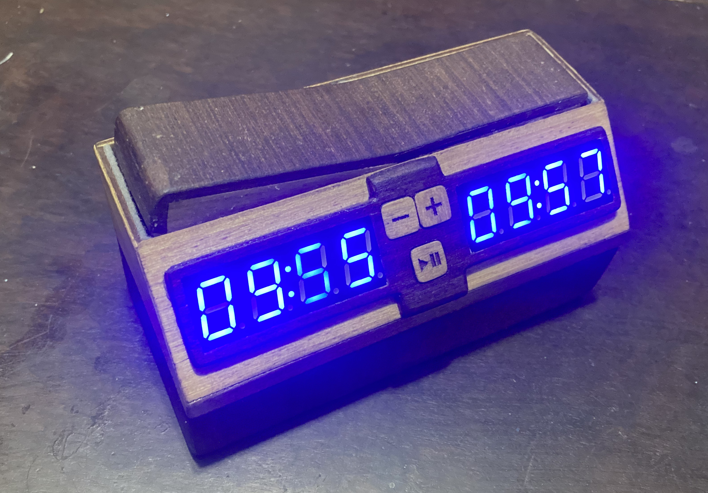

# Chess Clocks (Arduino)



## Hardware

Materials used for this project:
- Arduino Nano (or compatible)
- 2x Adafruit 7-segment LED backpacks (I2C)
- Buzzer
- Buttons for each player (mounted as push buttons or seesaw switch)
- Control buttons (start/pause/reset)
- Pull-up resistors for buttons (10k)
- Power supply (3x AA batteries)
- 47uF capacitor for buzzer
- 2200uF capacitor for power stabilization
- Schottky diode for reverse polarity protection
- Enclosure and seesaw switch with magnets (CNC cut)

Schematic:


Protoboard layout:


CNC cutting layout:


DXF files (for 2.5mm MDF and 2mm basswood):
[DXF file for CNC cutting](cnc_layout.dxf)
## Software

Develop and compile this sketch in CLion using `arduino-cli` through CMake custom targets.

## Project Layout

- `Chess_Clock_i2C/Chess_Clock_i2C.ino` - main sketch
- `Chess_Clock_i2C/notes.h` - note definitions used by the buzzer tune
- `CMakeLists.txt` - CLion targets for compile/upload/board discovery

## Prerequisites

- CLion
- `arduino-cli` available in `PATH`
- Arduino AVR core (`arduino:avr`)
- Libraries:
  - `Adafruit GFX Library`
  - `Adafruit LED Backpack Library`

Install prerequisites from terminal:

```bash
arduino-cli core install arduino:avr
arduino-cli lib install "Adafruit GFX Library"
arduino-cli lib install "Adafruit LED Backpack Library"
```

## CLion Setup

1. Open this folder in CLion: `chess-clocks`
2. Let CLion load `CMakeLists.txt`
3. In **Settings > Build, Execution, Deployment > CMake**, set options as needed:
   - `-DARDUINO_FQBN=arduino:avr:nano`
   - Optional for upload: `-DARDUINO_PORT=/dev/tty.usbmodemXXXX`
4. Reload CMake

## Available CLion Targets

- `arduino_compile` - compile sketch
- `arduino_upload` - upload (enabled when `ARDUINO_PORT` is set)
- `arduino_board_list` - list connected boards
- `arduino_libs_update` - install required libraries

Run them from the CLion target list or create Run Configurations for these targets.

## Quick Compile Check (terminal)

```bash
arduino-cli compile --fqbn arduino:avr:nano "/Users/helderdarocha/CLionProjects/chess-clocks/Chess_Clock_i2C"
```

If you use a different board, replace the FQBN accordingly.
