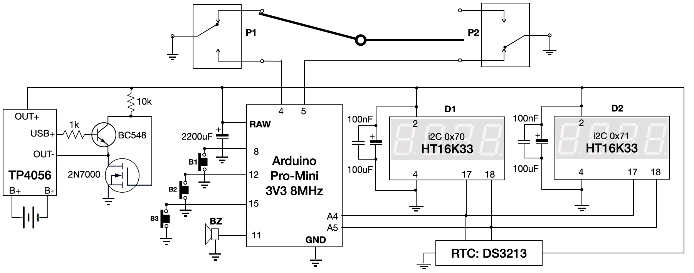
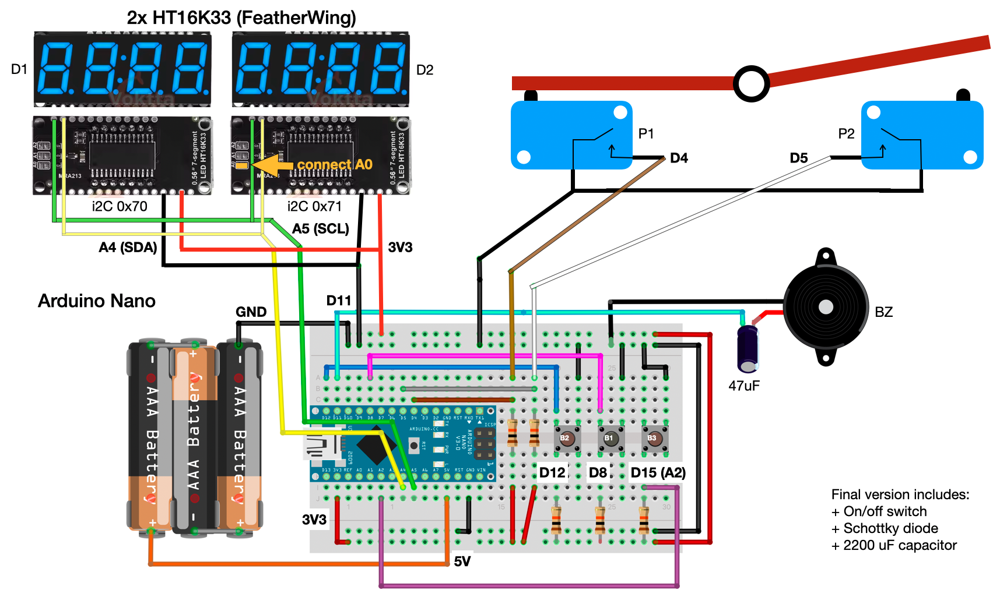
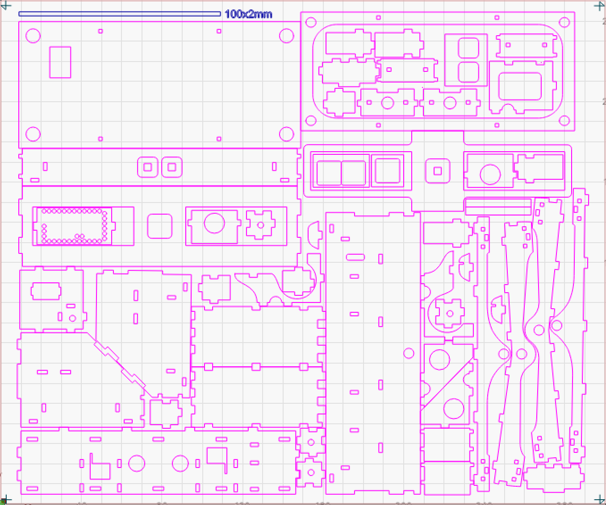
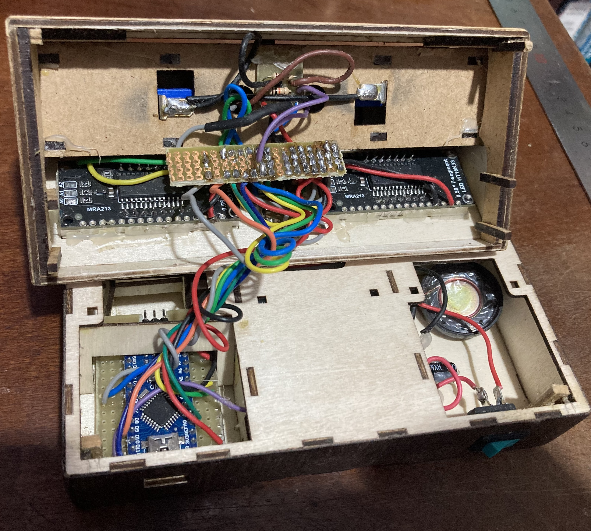
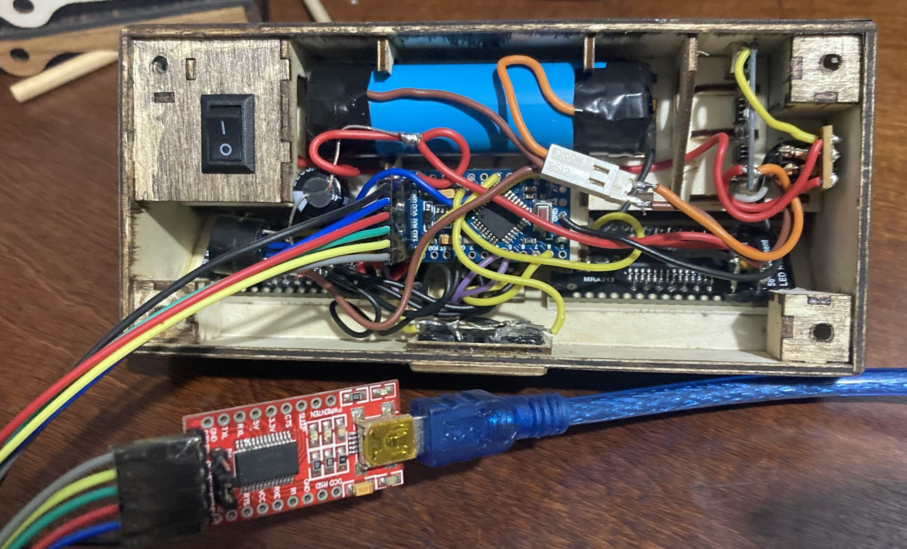

# Chess Clocks (Arduino)

20 presets for different time controls, including increment. Long pause allows adding or removing time during
a game. Sleep mode for power saving (after 5 minutes of inactivity). Optional DS3231 RTC module for
drift correction of the Arduino's millis() timer which uses a ceramic resonator instead of a crystal.

The case was CNC-cut from 2mm basswood. The seesaw switch is mounted on the top of the case and uses magnets to attract
the switch to the left or right side. Two microswitches are mounted under the seesaw switch to detect which side is pressed.
Any slight movement of the seesaw switch will trigger a button press. The case was decorated with 0.5mm wood sheets.

## Hardware

Materials used for this project:
- Arduino Pro Mini 3V3 8MHz (Clock 3) or Arduino Nano 5V 16MHz (Clock 2)
- 2x Adafruit 7-segment LED backpacks (I2C)
- Buzzer
- Buttons for each player (mounted as a pair of push buttons, or microswitches / seesaw switch)
- 3 control push buttons (start/pause/reset)
- 1 pull-up resistor for battery circuit (10k)
- Power supply (Clock 3: 3,7V Li-ion battery or Clock 2: 3x AA batteries)
- 2200uF capacitor for power stabilization
- 2 100uF capacitor to reduce flicker on LED displays
- 2 100nF capacitor for noise reduction on LED displays
- Schottky diode for reverse polarity protection (Clock 2: for 3xAA battery pack)
- BC548 transistor (Clock 3: for Li-ion battery circuit)
- 2N7000 MOSFET (Clock 3: for Li-ion battery circuit)
- TP4056 Li-ion battery charger module (Clock 3: for Li-ion battery circuit)
- DS3231 RTC module (optional, for accurate timekeeping)
- Enclosure and seesaw switch with magnets (CNC cut)
- On/off switch

Schematic (showing Li-on battery circuit - Clock 3):

Protoboard layout (showing 3xAA battery circuit - Clock 2):

## Case design
The DXF files for CNC cutter:
- [2mm Basswood - 1.8mm slots](dxf/2mm-basswood.dxf)
- [2mm Acrylic - 2mm slots](dxf/2mm-acrylic.dxf)

CNC cutting layout screenshot (this is what the file above looks like in Lightburn):
  

Circuit in the case

## Software

The code is written in C++ and uses the Arduino framework. Compile the `Chess_Clock_2` folder and upload to the correct Arduino board. 

## Project files

Files are in the `Chess_Clock_2` folder. They are used for both clocks, but the `config.h` file must be modified 
for the correct hardware configuration (battery, display, pins):

- `Chess_Clock_2.ino` - main sketch
- `config.h` - per-unit hardware configuration (battery, display, pins)
- `battery.h / battery.cpp` - battery voltage reading and low-battery warnings
- `notes.h, sound.h / sound.cpp` - buzzer tones and game-over melody
- `display.h / display.cpp` - 7-segment display rendering
- `power.h / power.cpp` - sleep mode for power saving
- `game.h / game.cpp` - game state machine and button handling, presets, seesaw switch macros
- `rtc.h / rtc.cpp` - optional DS3231: corrects millis() drift, no config needed