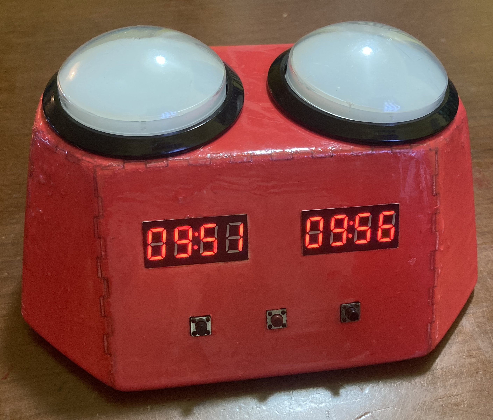
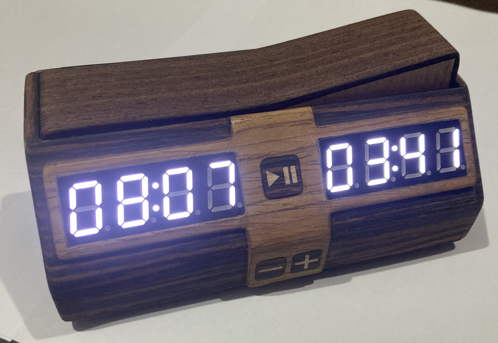
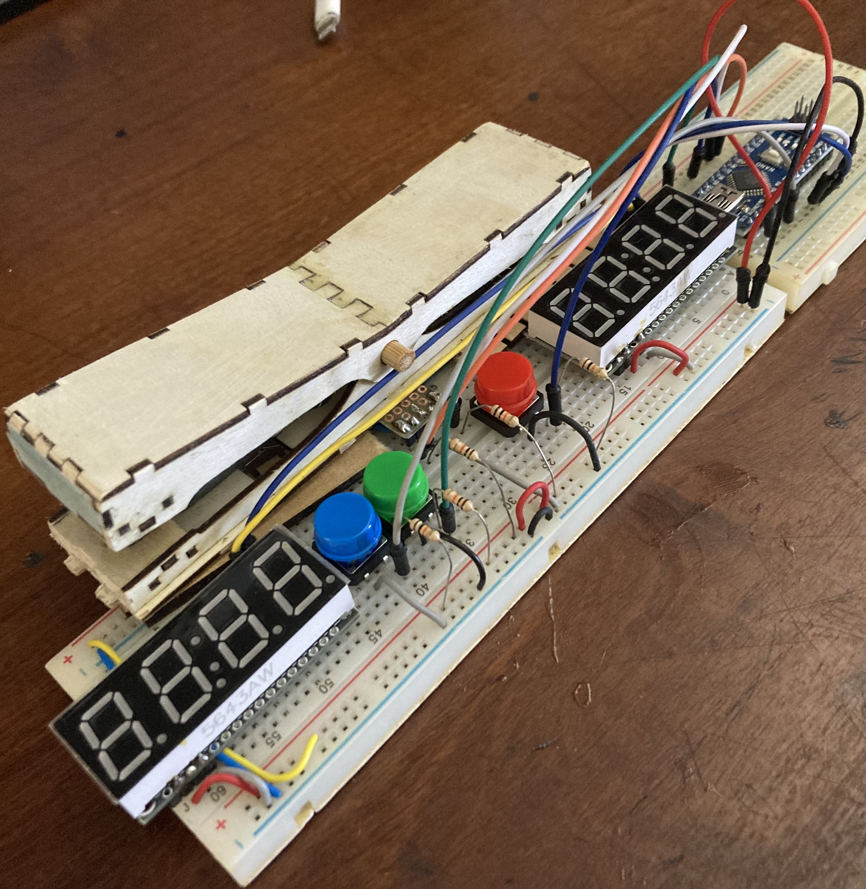

# Chess Clocks (Arduino)

First model (Clock 1) using 3xAA batteries, TM1637 displays, and led-powered arcade buttons 
in a resin-coated wooden case.

Old model (Clock 2) using 3xAA batteries, HT16K33 displays and pull-up resistors.

Current model (Clock 3) using Li-ion battery with TP4056 charger module.

The current code in this repository, and list of material plus schematic/protoboard is for Clocks 2 and 3.

All have 20 presets for different time controls, including increment. Long pause allows adding or removing time during
a game. Sleep mode for power saving (after 5 minutes of inactivity). Optional DS3231 RTC module for
drift correction of the Arduino's millis() timer which uses a ceramic resonator instead of a crystal.

The cases were CNC-cut from 2mm basswood (the case for a second model-3 clock was also cut from transparent 2mm acrylic). The seesaw switch is mounted on the top of the case and uses magnets to attract
the switch to the left or right side. Two microswitches are mounted under the seesaw switch to detect which side is pressed.
Any slight movement of the seesaw switch will trigger a button press. The case was decorated with 0.5 mm wood sheets.

## Hardware

Materials used for this project:
- Arduino Pro Mini 3V3 8MHz (Clock 3) or Arduino Nano 5V 16MHz (Clock 2)
- 2x Adafruit-compatible HT16K33 4-digit 7-segment LED displays (I2C)
- Buzzer
- Buttons for each player (mounted as a pair of push buttons, or microswitches / seesaw switch)
- 3 control push buttons (start/pause/reset)
- 1 pull-up resistor for battery circuit (10k)
- Power supply (Clock 3: 3,7V Li-ion battery or Clock 2: 3x AA batteries)
- 3 100µF capacitors (to filter noise)
- 3 100nF capacitors (to filter noise)
- Schottky diode for reverse polarity protection
- BC548 transistor (Clock 3: for Li-ion battery circuit)
- 2N7000 MOSFET (Clock 3: for Li-ion battery circuit)
- TP4056 Li-ion battery charger module (Clock 3: for Li-ion battery circuit)
- DS3231 RTC module (optional, for accurate timekeeping)
- Enclosure and seesaw switch with magnets (CNC cut)
- On/off switch

Schematic for Clock 3 (I no longer use pull-ups resistors for the buttons - I rely on the internal pull-ups of the Arduino Pro Mini):

Protoboard layout for Clock 2 (A bit outdated and I still didn't draw an updated one for Clock 3):

## Case design
The DXF files for CNC cutter (Clock 3):
- [2mm Basswood - 1.8mm slots](dxf/2mm-basswood.dxf)
- [2mm Acrylic - 2mm slots](dxf/2mm-acrylic.dxf)

CNC cutting layout screenshot for Clock 3 (this is what the file above looks like in Lightburn):
  

Circuit in the case (Clock 2 - old model). Programming is possible via the USB port of the Arduino Nano. 
The case is closed by pressing the halves together. Repairing is harder than Clock 3 and there are too
many wires.

Prototyping Clock 3. It uses a seesaw mechanism with 2 microswitches and magnets. The magnets are not used for
switching (I did not use a reed, as is common in many clocks), but to attract the seesaw switch to the left or right side. 
Any slight movement of the seesaw switch will trigger a button press.

Circuit in the (new) case during programming (Clock 3). Four rubber feet glued to screws are used to place
the lower cover. It still takes a long time to assemble, but it is easier to repair than the old model.
Programming requires an FTDI adapter, since it uses a Pro Mini. There are still too many wires (I need to design a PCB).

A robust 3D printed case, a PCB, a RISC-V microcontroller or a Seeduino XIAO are some ideas for the next projects.

## Software

The code is written in C++ and uses the Arduino framework. Compile the `Chess_Clock_2` folder and upload to the correct Arduino board. 

## Project files

Files are in the `Chess_Clock_2` folder. They are used for both clocks, but the `config.h` file must be modified 
for the correct hardware configuration (battery, display, pins):

- `Chess_Clock_2.ino` - main sketch
- `config.h` - per-unit hardware configuration (battery, display, pins)
- `battery.h / battery.cpp` - battery voltage reading and low-battery warnings
- `notes.h, sound.h / sound.cpp` - buzzer tones and game-over melody
- `display.h / display.cpp` - 7-segment display rendering
- `power.h / power.cpp` - sleep mode for power saving
- `game.h / game.cpp` - game state machine and button handling, presets, seesaw switch macros
- `rtc.h / rtc.cpp` - optional DS3231: corrects millis() drift, no config needed

## User Guide
### Selecting the game duration
When powered on, the clock starts in game duration mode. To confirm the current duration, press ⏸️ / ▶️. This will put the clock into paused mode. Press ⏸️ / ▶️ again to start the countdown on the active display (the side of the raised lever).

To select a different duration, use ➕ to move forward or ➖ to go back. There are 20 preset game time options. The first display shows the option number and the second display shows the time in minutes + bonus in seconds:

- Bullet (00-03): 1+0, 1+1, 2+0, 2+1
- Blitz (04-07): 3+0, 3+2, 5+0, 5+3
- Rapid (08-13): 10+0, 10+5, 15+0, 15+10, 30+0, 30+15
- Classic (14-19): 45+0, 45+30, 60+0, 60+30, 90+0, 90+30

The clock remembers the last option selected, even after being turned off.

### To get started

Turn on the clock (power button). The displays show the last game duration used.

Position the lever so the starting player can press it when the game begins, and press ⏸️ / ▶️ to start the countdown with the current duration.

The clock enters game mode.

Each press of the lever adds a bonus in seconds (if the selected duration has a bonus set) before stopping the corresponding clock.

### Time adjustment
To adjust time during a game (to apply penalties):

1. Pause the game with ⏸️ / ▶️. The clock enters paused mode.
2. Press and hold ⏸️ / ▶️ for 2 seconds. The clock enters time adjustment mode. Only the first display will be lit.
3. If the first display's time is not to be changed, press ⏸️ / ▶️ to skip to the second display.
4. Adjust the time on the active display using the ➕ (adds 1 minute) and ➖ (removes 1 minute) buttons. To confirm, press ⏸️ / ▶️.
5. Pressing ⏸️ / ▶️ while the first display is lit selects the second display (turns off the first, turns on the second). Pressing this key again returns to paused mode.
6. To exit paused mode, press ⏸️ / ▶️ again to restart the countdown.

The clock displays time in MM:SS format up to 99:59. Larger values are shown in H:MM format (e.g., 1:40), with the ":" of the active clock blinking every half second. The clock returns to MM:SS format once the H:MM countdown drops below 1:38. The maximum supported time is 9:59:59.

### End of game
When a player's time reaches zero, game mode ends:

1. The clocks stop counting (finished mode)
2. A tune is played

To start a new game after time has run out, press ⏸️ / ▶️.

### Restart
To restart at any time, turn the clock off and back on (power button) or, while paused or finished, press the ➕ and ➖ buttons simultaneously. The clock restarts (in game duration mode) with the last duration used.

### Operation and power
On startup, if the batteries need to be replaced, the displays will flash the message BAtt Lo-- twice along with three soft beeps, before displaying the game duration. The sounds will repeat every minute while the clock is on.

The clock will enter low-power mode and turn off the displays if it is not in game mode (counting time) and remains untouched — with no button or lever pressed — for more than 5 minutes. Pressing any button or lever will wake the clock.

In low-power mode, consumption is very low but not zero. After using the clock, turn it off.

To charge the battery, connect a USB-A to USB-C cable to the back of the clock. When charging is complete, the indicator LED will turn blue. USB-C to USB-C cables do not work on older clocks.

### Other features
These features were added recently:
- Turn sound off pressing the ➖ button for 3 seconds, or turn sounds on pressing ➕ for 3 seconds, when paused.
  Turning off sound does not turn off the Low Battery beep at startup.
- View how many moves were played and total time by pressing ➖ when paused. 

### Experimental features (not yet committed in the main branch)
- Add new user-defined presets and adjust different hours, minutes, seconds, and bonus seconds by adding / subtracting to individual digits
- Save last time values and stats (total time, moves) in EEPROM
- Adjust LED brightness
- Inform % of battery remaining